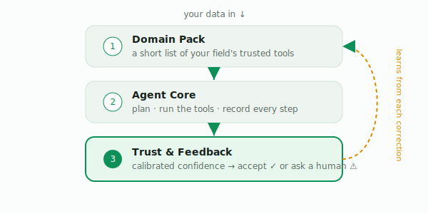

<div align="center">

# Caliper

### The research assistant that tells you when to trust it.

[](LICENSE)
[](pyproject.toml)
[](tests/)
[](#status--roadmap)
[](#llm-providers)

*An AI analyst that runs your data pipelines end-to-end, reports calibrated confidence on every result, and escalates to a human exactly when it shouldn't be trusted — getting sharper with each correction.*

</div>

---

Modern science runs on software that most scientists were never trained to use — and
can't easily tell whether to believe. Caliper does the analysis for you. And it does
the one thing no tool does today: it tells you, honestly, **when the answer is solid
and when you should ask a human.**

It is a ready-to-use agent. The calibrated-trust-and-feedback layer is what makes it
worth trusting unattended.

## Why it exists

Existing science agents build a curated toolbox and an agent to drive it, then hand you
an answer with **no bound on being wrong** — so a resource-constrained scientist still
can't act on it unattended. Caliper closes that gap, across fields.

## How it works — three thin layers

<p align="center">
  
</p>

| Layer | What it is |
|-------|------------|
| **① Domain Pack** | A small, versioned registry of a field's vetted tools (metadata — the model already knows the rest). |
| **② Agent Core** | Plan → pick tools → run code → keep a reproducible record. |
| **③ Trust & Feedback** | Calibrated confidence on every result, a provable bound on confidently-wrong answers, escalation to a human, and recalibration from each correction. |

One core, swappable packs. Ships with a working **`bio`** pack (genomics); **`astro`**
is a skeleton proving the core is domain-agnostic.

## How Caliper is different from other science agents

Most science-AI agents focus on *capability* — assembling tools and automating the
analysis. Caliper adds the piece they leave out: an honest, **calibrated** signal of
*when to trust the result*, and the discipline to hand borderline cases back to a human.

| | Curated tools | Runs analysis end-to-end | Calibrated confidence | Defers to a human when unsure | Learns from your corrections |
|---|:--:|:--:|:--:|:--:|:--:|
| **Caliper** | ✅ | ✅ | ✅ | ✅ | ✅ |
| General-purpose science agents | ✅ | ✅ | — | — | — |
| Autonomous research agents | ✅ | ✅ | — | ✗ *(no human in the loop)* | — |
| A bare LLM + tools | partial | partial | — | — | — |

Others hand you an answer. Caliper hands you an answer **plus a provable bound on how
often it is wrong when it doesn't ask for help** — and sharpens that judgment every time
you correct it.

<sub>Comparison reflects each category's described design at the time of writing. These are complementary efforts; Caliper's trust layer can in principle sit on top of an existing agent.</sub>

## The promise you can set

Give Caliper a rule in plain terms — *"never let more than 1 in 10 of the answers you
hand me unchecked be wrong"* — and it keeps it. From a modest set of expert-checked
examples it learns exactly how confident it must be before answering on its own;
anything below that bar it escalates. The guarantee is finite-sample and
distribution-free, and it holds **even when the underlying judge is imperfect** —
because it would rather ask for help than mislead you.

## Quickstart

```bash
pip install -e .
python examples/bio_demo.py        # full run: analyze → grade confidence → decide
python examples/feedback_loop.py   # watch it grow more confident as feedback arrives
python -m unittest discover -s tests
```

## LLM providers

Provider-agnostic via `make_llm(provider=...)` or the `CALIPER_PROVIDER` env var.

```python
from caliper import make_llm
llm = make_llm()                              # default
llm = make_llm("openai")                       # OpenAI
llm = make_llm("openai", model="gpt-5-chat-latest")
```

## Status & roadmap

**Research preview.** Working: thin core, `bio` pack, calibrated gate (tested),
multi-provider models, live feedback recalibration, offline + live demos. Next:
exact-validity calibration (Learn-then-Test), a real genomics tool environment and a
reproduced published study, distribution-shift robustness, and a fleshed-out `astro`
pack. See [`docs/DEVELOPERS.md`](docs/DEVELOPERS.md) for the architecture and the math.

## License

Apache 2.0 — see [`LICENSE`](LICENSE). Caliper is an independent reimplementation; it
reuses no third-party code verbatim. Prior art is credited in [`NOTICE`](NOTICE).
Underlying domain tools carry their own licenses; review before commercial use.
